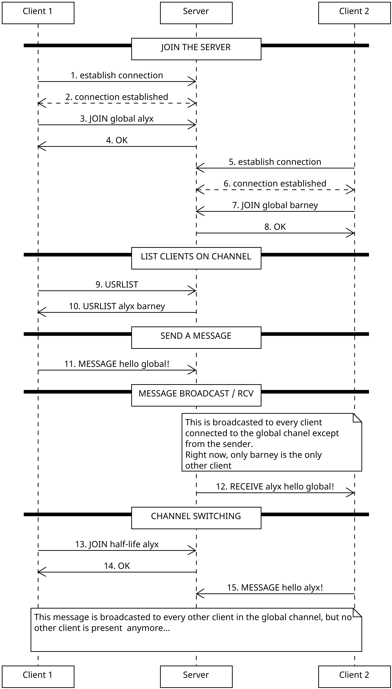
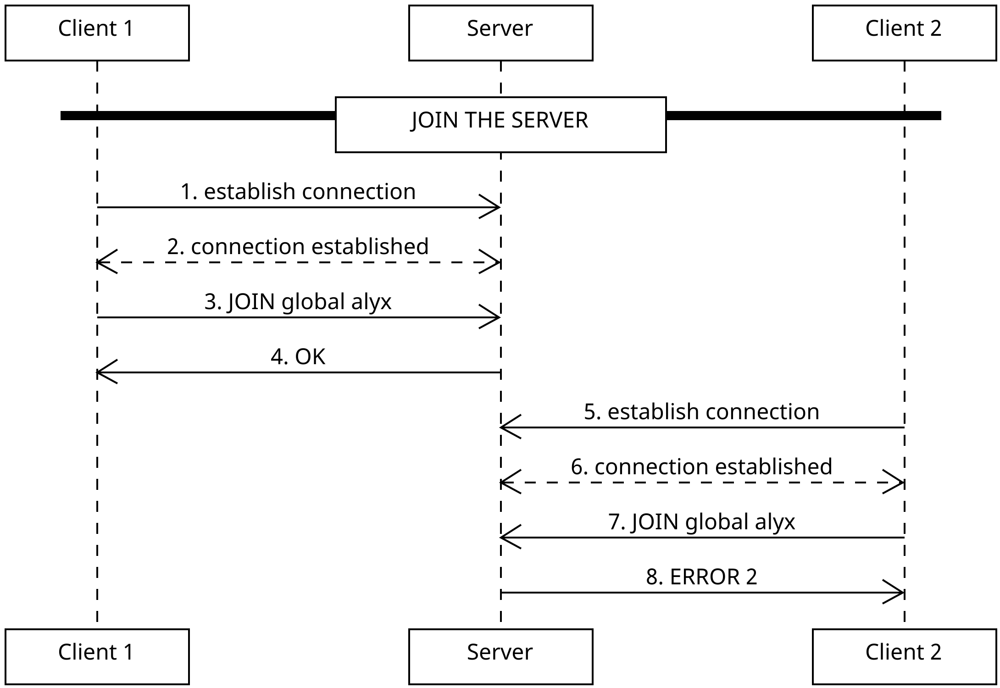

# CHCH Protocol

This protocol defines a simple multi-user chat system. Each user can join any existing channel on the server and exchange messages with others in that same channel.

## Section 1 - Overview

The goal of the CHCH protocol is to enable clients to send and receive text messages across multiple channels hosted by a central server. Users choose a username, join a channel, and communicate with other connected clients.

## Section 2 - Transport Protocol

CHCH uses a persistent **TCP** connection on **port 4269** for all communication. All protocol messages are **UTF-8 encoded**, line-based text commands terminated with `\n`.

Messages are sent and processed sequentially over the same stream. The server maintains one connection per client and routes messages to other clients in the same channel.

### Why TCP?

We use TCP because the protocol requires:

- guaranteed message delivery,
- ordered messages,
- and a simple, stream-based communication model.

UDP would require manually handling reliability and ordering, adding unnecessary complexity for a chat system.

## Section 3 - Messages

### Join the Server

The client sends a join request indicating the desired username and channel.

**Request**

```
JOIN <channel> <username>
```

- `username`: the client’s chosen name
- `channel`: the channel to join

**Response**

- `OK`: access granted
- `ERROR <code>`:
    - `1`: the channel does not exist
    - `2`: the username is already taken by a user in that chanel

---

### Username Change

The client sends a nick request indicating the desired new username.

**Request**
```
NICK <new_username>
```
- `new_username`: the client's desired new username

**Response**
- `OK`: username granted
- `ERROR <code>`
    - `1`: the username is already taken by a user in the current channel

---

### List Users in Current Channel

The client may request the list of all currently connected users on their current channel.

**Request**

```
USRLIST
```

**Response**

```
USRLIST <username1> <username2> <username3> ...
```

Returns the list of usernames currently on the client's channel.

---

### List Channels

The client may request the list of all available channels on the server.

**Request**

```
CHANLIST
```

**Response**

```
CHANLIST <channel1> <channel2> <channel3> ...
```

Returns the list of channel names.

---

### Send a Message

The client can send a message to the channel he is currently on.

**Request**

```
MESSAGE <contents>
```

- `contents`: the message contents. Any UTF-8 encoded string.

**Response**

None.

---

### Server Broadcast on Channel

When the server receives a message, it broadcasts it to all users in the same channel.

**Broadcast Format**

```
RECEIVE <username> <message>
```

- `username`: the sender’s username
- `message`: the message content

---

### Message history

The client may request the message history for his current channel.

**Rquest**

```
HISTORY
```

**Response**

The server will send multiple `RECIEVE <username> <message>` for each message in the history.

---

### User Joined Channel

When a user has joined a channel, the server broadcasts to all users in that channel that a user has joined.

**Broadcast Format**

```
JOINED <username>
```

- `username`: the username who joined


## Section 4 - Examples

### Basic Flow



### Errorneous Join Flow

